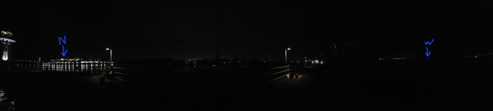
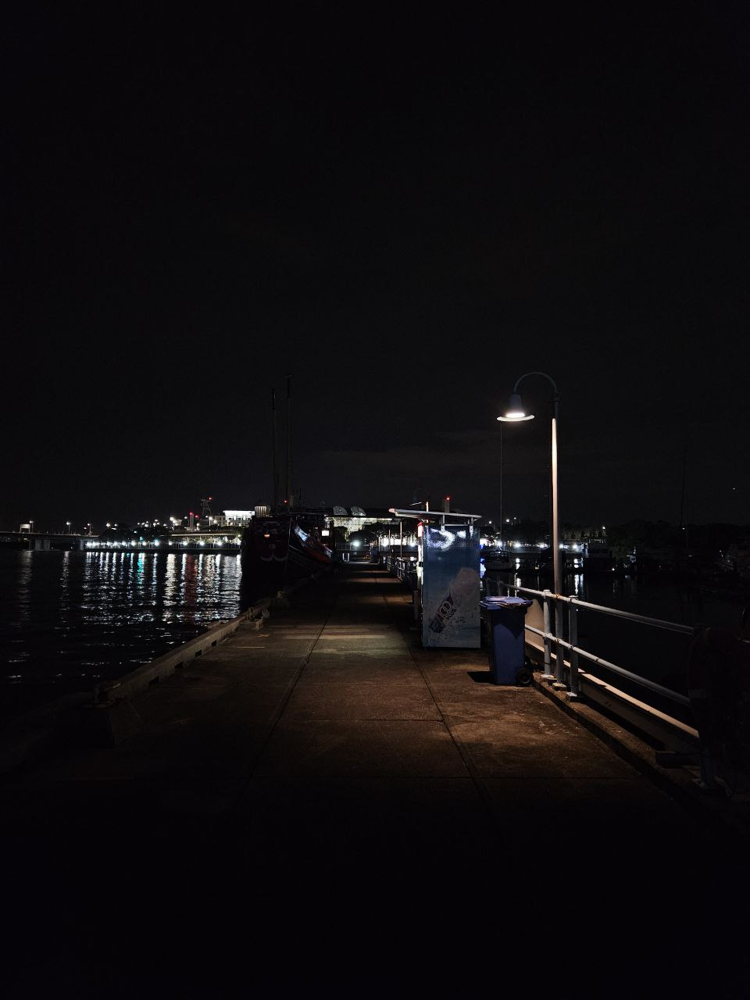
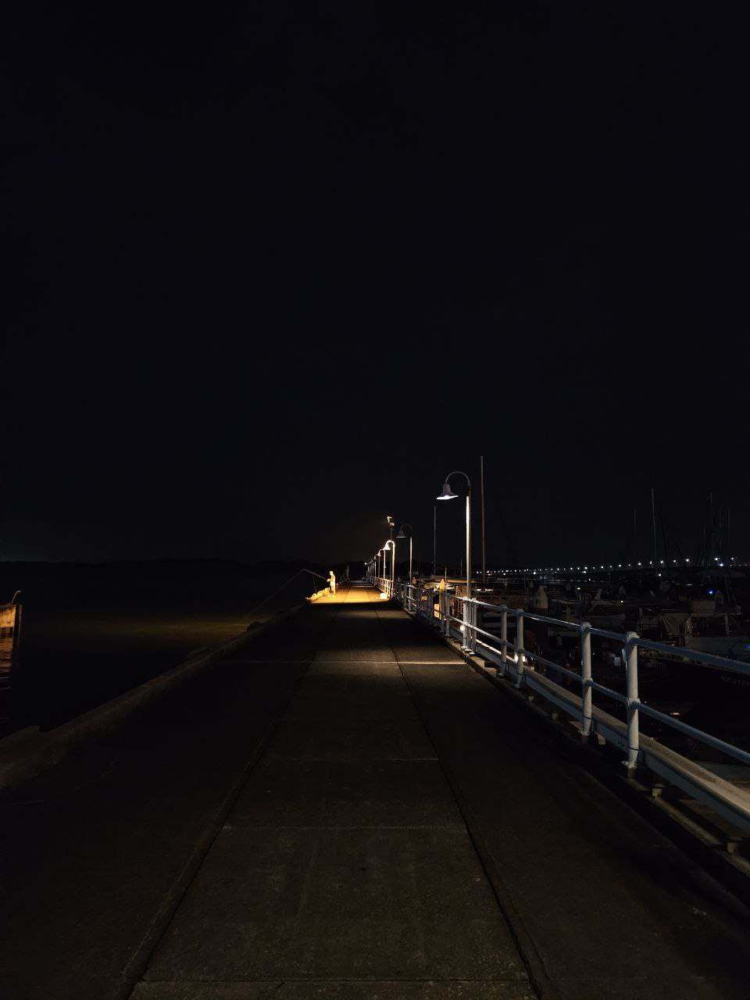
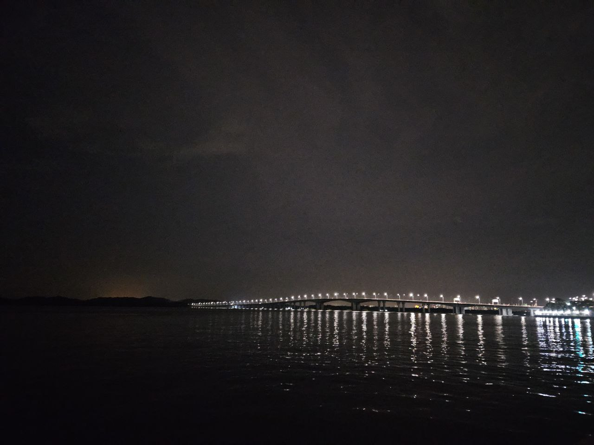

<!DOCTYPE html>
<html lang="en">
<head>
    <meta charset="UTF-8">
    <meta name="viewport" content="width=device-width, initial-scale=1.0">
    <title>RafflesMarina</title>
    
</head>
<body>
    

        

            

                

                    
                

            

        

    

</body>
</html>
## TLDR:
- low horizon: east, west, south, north
- overall darkness: 3/3
- dark regions: west
- food/drinks options: no food; drinks, food and ice cream vending machines
- insect: no, but yes if you sit at the restaurant seats 
- transportation: good, tuas link station + drivable to carpark
- terrain accessibility: paved ground, no stairs, no slope, 10mins from mrt, 5mins from carpark
- regulations: yes, no outside drinks, scope at ur own risk, binos ok
- shelter: 3mins away
- time-gated: no
- toilet: yes
- obs site: paved

#### Notes:
Portable chairs are ok but might not have space if you bring a scope as well so its either or. There is a rule against obstructing the pathway.

<!DOCTYPE html>
<html lang="en">
<head>
    <meta charset="UTF-8">
    <meta name="viewport" content="width=device-width, initial-scale=1.0">
    <title>Clouds</title>
    
</head>
<body>
    

        

            
        

        

            
        

        

            
        

        

            
        

    

</body>
</html>
