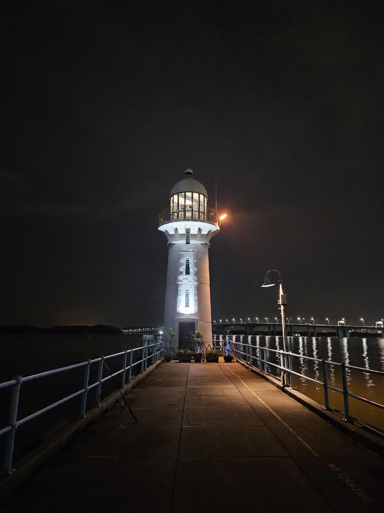
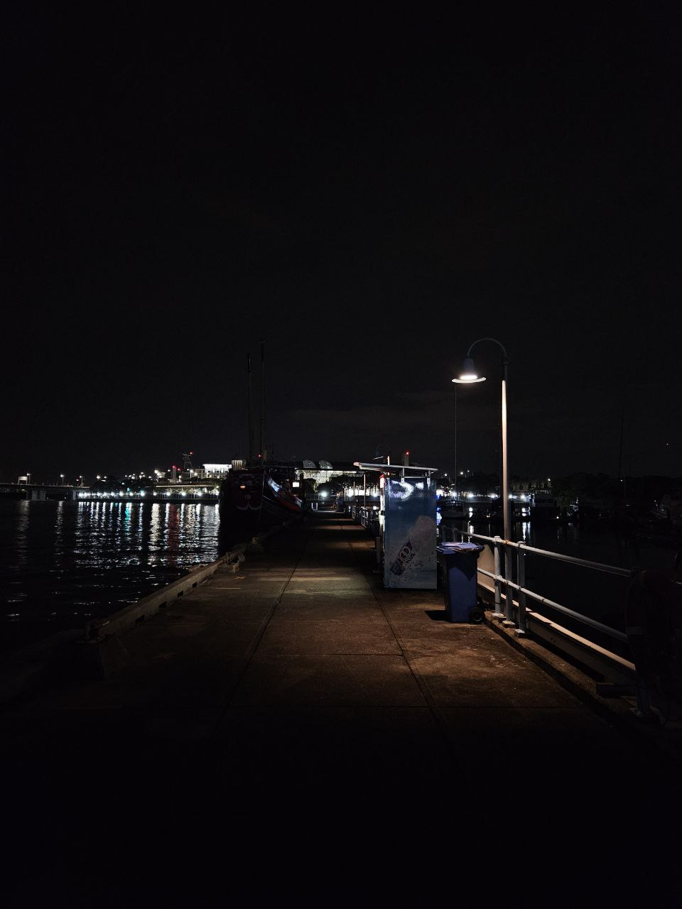
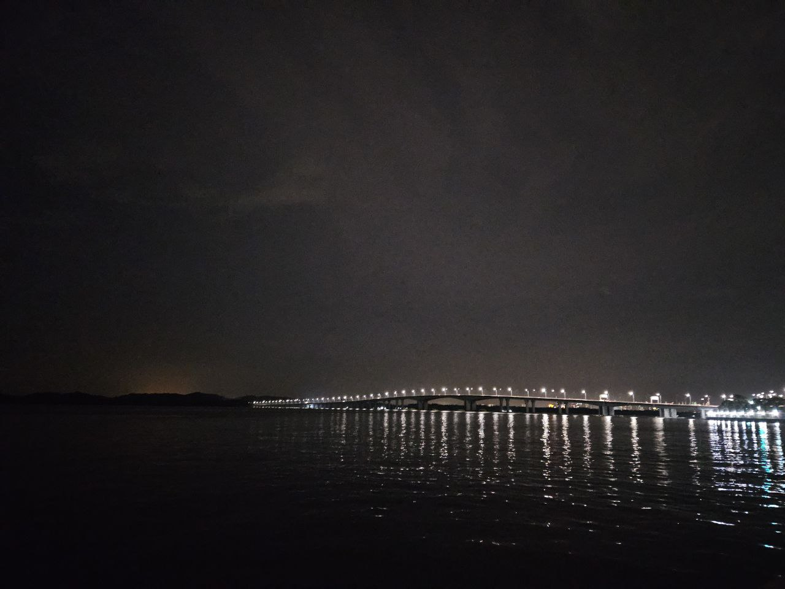

<!DOCTYPE html>
<html lang="en">
<head>
    <meta charset="UTF-8">
    <meta name="viewport" content="width=device-width, initial-scale=1.0">
    <title>Raffles Marina</title>
    
</head>
<body>
    

        

            
        

        

            
        

        

            
        

        

            
        

        

            
        

    

    

        <h2>TLDR:</h2>
        <ul>
            <li><strong>Low horizon:</strong> east, west, south, north</li>
            <li><strong>Overall darkness:</strong> 3/3</li>
            <li><strong>Dark regions:</strong> west</li>
            <li><strong>Food/drinks options:</strong> no food; drinks, food, and ice cream vending machines</li>
            <li><strong>Insect:</strong> no, but yes if you sit at the restaurant seats</li>
            <li><strong>Transportation:</strong> 10 mins walk from Tuas Link station OR 5 mins walk from carpark</li>
            <li><strong>Terrain accessibility:</strong> paved ground, no stairs, no slope, slight tiling on paved ground</li>
            <li><strong>Regulations:</strong> 
            <ul>
                <li>no outside drinks</li>
                <li>scope at your own risk, binoculars ok</li>
                <li>no obstructing pathway</li>
            </ul>
            </li>
            <li><strong>Shelter:</strong> 3 mins away</li>
            <li><strong>Time-gated:</strong> no</li>
            <li><strong>Toilet:</strong> yes</li>
            <li><strong>Observation site:</strong> paved</li>
        </ul>
        
<strong>Notes:</strong> Portable chairs are ok but might not have space if you bring a scope as well, so it's either or. 

    

</body>
</html>

